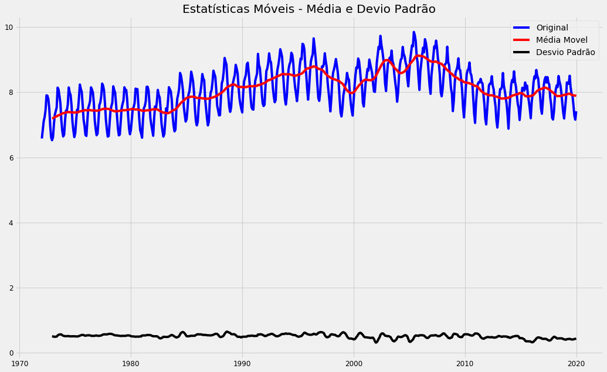
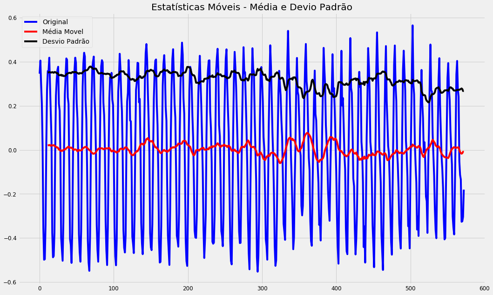

<strong><b><font size="5">Análise Estatística e Modelagem Preditiva de Séries Temporais - Em Python</font></b></strong>

**Exercício 1**:

Seu trabalho neste exercício é analisar a série temporal de produção mensal de sorvete entre 1972 e 2020 e então responder à pergunta abaixo:

1- Essa série temporal é estacionária ou não estacionária? Apresente o resultado da sua análise para justificar sua resposta.

O dataset fornecido a você é uma versão simplificada do dataset Icecream, resultado de um estudo realizado nos EUA:

https://rdrr.io/rforge/Ecdat/man/Index.Time.Series.html


**Exercício 2**:

Neste exercício você usará um dataset disponível no pacote yfinance (que deve ser instalado conforme mostrado abaixo). Já podemos antecipar que a série NÃO é estacionária e seu trabalho é aplicar as transformações necessárias para converter a série em estacionária.

Aproveite a oportunidade para estudar e revisar tudo que foi mostrado até aqui no curso, antes de avançarmos para temas mais complexos nas próximas aulas.

### Carregando e Preparando os Dados

Vamos carregar os dados e prepará-los para mais uma rodada de análise.


```python
# As novas versões do Pandas e Matplotlib trazem diversas mensagens de aviso ao desenvolvedor. Vamos desativar isso.
import sys
import warnings
import matplotlib.cbook
if not sys.warnoptions:
    warnings.simplefilter("ignore")
warnings.simplefilter(action='ignore', category=FutureWarning)
warnings.filterwarnings("ignore", category=FutureWarning)
warnings.filterwarnings("ignore", category=matplotlib.cbook.mplDeprecation)

# Imports para manipulação de dados
import numpy as np
import pandas as pd

# Imports para visualização de dados
import matplotlib.pyplot as plt
import matplotlib as m
import seaborn as sns
import yfinance as yf

# Imports para análise de dados
import statsmodels.api as sm
from statsmodels.tsa.stattools import adfuller
from statsmodels.graphics.tsaplots import plot_acf
from statsmodels.graphics.tsaplots import plot_pacf


# Imports para análise de dados
from scipy.stats import boxcox

# Imports para formatação dos gráficos
plt.style.use('fivethirtyeight')
m.rcParams['axes.labelsize'] = 14
m.rcParams['xtick.labelsize'] = 12
m.rcParams['ytick.labelsize'] = 12
m.rcParams['text.color'] = 'k'
from pylab import rcParams
rcParams['figure.figsize'] = 18, 8
```

## Exercício 1

Seu trabalho neste exercício é analisar a série temporal de produção mensal de sorvete entre 1972 e 2020 e então responder à pergunta abaixo:

1- Essa série temporal é estacionária ou não estacionária? Apresente o resultado da sua análise para justificar sua resposta.

O dataset fornecido a você é uma versão simplificada do dataset Icecream, resultado de um estudo realizado nos EUA:

https://rdrr.io/rforge/Ecdat/man/Index.Time.Series.html


```python
# Carrega os dados
dados_serie = pd.read_csv('https://raw.githubusercontent.com/dsacademybr/Datasets/master/dataset2.csv')
```


```python
# Série
dados_serie.head()
```


<div>
<style scoped>
    .dataframe tbody tr th:only-of-type {
        vertical-align: middle;
    }

    .dataframe tbody tr th {
        vertical-align: top;
    }

    .dataframe thead th {
        text-align: right;
    }
</style>
<table border="1" class="dataframe">
  <thead>
    <tr style="text-align: right;">
      <th></th>
      <th>DATE</th>
      <th>NUMBER</th>
    </tr>
  </thead>
  <tbody>
    <tr>
      <th>0</th>
      <td>1972-01-01</td>
      <td>59.9622</td>
    </tr>
    <tr>
      <th>1</th>
      <td>1972-02-01</td>
      <td>67.0605</td>
    </tr>
    <tr>
      <th>2</th>
      <td>1972-03-01</td>
      <td>74.2350</td>
    </tr>
    <tr>
      <th>3</th>
      <td>1972-04-01</td>
      <td>78.1120</td>
    </tr>
    <tr>
      <th>4</th>
      <td>1972-05-01</td>
      <td>84.7636</td>
    </tr>
  </tbody>
</table>
</div>


```python
# Ajusta o nome das colunas
dados_serie.rename(columns = {'DATE':'data', 'NUMBER':'producao'}, inplace = True)
```


```python
# Série
dados_serie.head()
```


<div>
<style scoped>
    .dataframe tbody tr th:only-of-type {
        vertical-align: middle;
    }

    .dataframe tbody tr th {
        vertical-align: top;
    }

    .dataframe thead th {
        text-align: right;
    }
</style>
<table border="1" class="dataframe">
  <thead>
    <tr style="text-align: right;">
      <th></th>
      <th>data</th>
      <th>producao</th>
    </tr>
  </thead>
  <tbody>
    <tr>
      <th>0</th>
      <td>1972-01-01</td>
      <td>59.9622</td>
    </tr>
    <tr>
      <th>1</th>
      <td>1972-02-01</td>
      <td>67.0605</td>
    </tr>
    <tr>
      <th>2</th>
      <td>1972-03-01</td>
      <td>74.2350</td>
    </tr>
    <tr>
      <th>3</th>
      <td>1972-04-01</td>
      <td>78.1120</td>
    </tr>
    <tr>
      <th>4</th>
      <td>1972-05-01</td>
      <td>84.7636</td>
    </tr>
  </tbody>
</table>
</div>


## 1. Transformando a coluna data em timestamp


```python
# Convertendo a coluna data de object para datetime  
dados_serie['data'] = pd.to_datetime(dados_serie['data'], format = '%Y-%m-%d')
```


```python
dados_serie.info()
```

    <class 'pandas.core.frame.DataFrame'>
    RangeIndex: 577 entries, 0 to 576
    Data columns (total 2 columns):
     #   Column    Non-Null Count  Dtype         
    ---  ------    --------------  -----         
     0   data      577 non-null    datetime64[ns]
     1   producao  577 non-null    float64       
    dtypes: datetime64[ns](1), float64(1)
    memory usage: 9.1 KB


## 2. Transformando a data em index


```python
dados_serie = dados_serie.set_index('data')
dados_serie.head()
```


<div>
<style scoped>
    .dataframe tbody tr th:only-of-type {
        vertical-align: middle;
    }

    .dataframe tbody tr th {
        vertical-align: top;
    }

    .dataframe thead th {
        text-align: right;
    }
</style>
<table border="1" class="dataframe">
  <thead>
    <tr style="text-align: right;">
      <th></th>
      <th>producao</th>
    </tr>
    <tr>
      <th>data</th>
      <th></th>
    </tr>
  </thead>
  <tbody>
    <tr>
      <th>1972-01-01</th>
      <td>59.9622</td>
    </tr>
    <tr>
      <th>1972-02-01</th>
      <td>67.0605</td>
    </tr>
    <tr>
      <th>1972-03-01</th>
      <td>74.2350</td>
    </tr>
    <tr>
      <th>1972-04-01</th>
      <td>78.1120</td>
    </tr>
    <tr>
      <th>1972-05-01</th>
      <td>84.7636</td>
    </tr>
  </tbody>
</table>
</div>


## 3. Método para validar se a série é estacionária


```python
def teste_estacionaridade(serie):
    
    # A janela é 12 porque estamos fazendo a janela para o período anual
    rolmean = serie.rolling(window = 12).mean()
    rolstd = serie.rolling(window = 12).std()
    
    # Plot das estatísticas móveis
    orig = plt.plot(serie, color = 'blue', label = 'Original')
    mean = plt.plot(rolmean, color = 'red', label = 'Média Movel')
    std = plt.plot(rolstd, color = 'black', label = 'Desvio Padrão')
    plt.legend(loc = 'best')
    plt.title("Estatísticas Móveis - Média e Devio Padrão")
    plt.show()
    
    # Teste Dickey-Fuller
    print("\nResultado do Teste Dickey-Fuller:\n")
    dfteste = adfuller(serie, autolag = 'AIC')
    
    # Formatando a saída
    dfsaida = pd.Series(dfteste[0:4], index = ['Estatítisca do Teste',
                                               'Valor-p',
                                               'Numero de lags consideradas',
                                               'Número de observações usada'])
    
    # Loop por cada item de saída do teste
    for key, value in dfteste[4].items():
        dfsaida["valor Crítico (%s)"%key] = value
        
    # print
    print(dfsaida)
    
    # Testa o valor-p
    print ('\nConclusão:')
    if dfsaida[1] > 0.05:
        print('\nO valor-p é maior que 0.05 e, portanto, não temos evidências para rejeitar a hipótese nula.')
        print('Essa série provavelmente não é estacionária.')
    else:
        print('\nO valor-p é menor que 0.05 e, portanto, temos evidências para rejeitar a hipótese nula.')
        print('Essa série provavelmente é estacionária.')
```


```python
teste_estacionaridade(dados_serie)
```


    
    Resultado do Teste Dickey-Fuller:
    
    Estatítisca do Teste            -1.758009
    Valor-p                          0.401499
    Numero de lags consideradas     19.000000
    Número de observações usada    557.000000
    valor Crítico (1%)              -3.442145
    valor Crítico (5%)              -2.866743
    valor Crítico (10%)             -2.569541
    dtype: float64
    
    Conclusão:
    
    O valor-p é maior que 0.05 e, portanto, não temos evidências para rejeitar a hipótese nula.
    Essa série provavelmente não é estacionária.


## 4. Decompondo a série


```python
# Decomposição Multiplicativa
decomposicao_multiplicativa = sm.tsa.seasonal_decompose(dados_serie, model='multiplicative',
                                                        extrapolate_trend='freq')

# Decomposição Aditiva
decomposicao_aditiva = sm.tsa.seasonal_decompose(dados_serie, model='aditive',
                                                 extrapolate_trend='freq')

# Plot
plt.rcParams.update({'figure.figsize': (16,10)})
decomposicao_multiplicativa.plot().suptitle("Decompisição Mutiplicativa", fontsize=22)
decomposicao_aditiva.plot().suptitle("Decomposição Aditiva", fontsize=22)
plt.show()
```


## 5. Plots ACF e PACF


```python
# Plots
plt.rcParams.update({'figure.figsize': (16,10)})

# Plot do gráfico ACF
# https://www.statsmodels.org/stable/generated/statsmodels.graphics.tsaplots.plot_acf.html
plt.subplot(211)
plot_acf(dados_serie.producao, ax = plt.gca(), lags = 30)

# Plot do gráfico PACF
# https://www.statsmodels.org/stable/generated/statsmodels.graphics.tsaplots.plot_pacf.html
plt.subplot(212)
plot_pacf(dados_serie.producao, ax = plt.gca(), lags = 30)
plt.show()
```


Como é possível ver na imagem, temos diversos valores ACF (barras verticais) acima do limite da área sombreada em azul. Nesses casos, a autocorrelação é diferente de zero, indicando que a série não é aleatória – conforme o esperado.

Algumas barras verticais estão dentro do limite da área sombreada em azul, Ou seja, a autocorrelação entre a série com alguns de seus lags é igual a zero, indicando que não há correlação.

**Analise:**
- Se a série temporal for estacionária, os gráficos do ACF / PACF mostrarão uma "queda rápida na correlação" após um pequeno atraso entre os pontos. Não é o caso em nossos gráficos. A queda lenda (redução do tamanho das barras) indica que essa série não é estacionária).

- Os dados da nossa série não são estacionários, pois um número alto de observações anteriores está correlacionado com valores futuros.


## 6. Aplicando a técnica de BoxCox


```python
# Aplicando Transformação Box-Cox
dados_serie['producao_box'], lam_value = boxcox(dados_serie['producao'])
print('Valor Ideal de Lambda: %f' % lam_value)
dados_serie.head()
```

    Valor Ideal de Lambda: 0.215939


<div>
<style scoped>
    .dataframe tbody tr th:only-of-type {
        vertical-align: middle;
    }

    .dataframe tbody tr th {
        vertical-align: top;
    }

    .dataframe thead th {
        text-align: right;
    }
</style>
<table border="1" class="dataframe">
  <thead>
    <tr style="text-align: right;">
      <th></th>
      <th>producao</th>
      <th>producao_box</th>
    </tr>
    <tr>
      <th>data</th>
      <th></th>
      <th></th>
    </tr>
  </thead>
  <tbody>
    <tr>
      <th>1972-01-01</th>
      <td>59.9622</td>
      <td>6.578447</td>
    </tr>
    <tr>
      <th>1972-02-01</th>
      <td>67.0605</td>
      <td>6.852557</td>
    </tr>
    <tr>
      <th>1972-03-01</th>
      <td>74.2350</td>
      <td>7.107384</td>
    </tr>
    <tr>
      <th>1972-04-01</th>
      <td>78.1120</td>
      <td>7.237135</td>
    </tr>
    <tr>
      <th>1972-05-01</th>
      <td>84.7636</td>
      <td>7.448431</td>
    </tr>
  </tbody>
</table>
</div>


```python
dados_serie_box_cox = dados_serie.copy().drop(columns=['producao'])
dados_serie.drop(columns = ['producao_box'], inplace = True)
dados_serie_box_cox.head()
```


<div>
<style scoped>
    .dataframe tbody tr th:only-of-type {
        vertical-align: middle;
    }

    .dataframe tbody tr th {
        vertical-align: top;
    }

    .dataframe thead th {
        text-align: right;
    }
</style>
<table border="1" class="dataframe">
  <thead>
    <tr style="text-align: right;">
      <th></th>
      <th>producao_box</th>
    </tr>
    <tr>
      <th>data</th>
      <th></th>
    </tr>
  </thead>
  <tbody>
    <tr>
      <th>1972-01-01</th>
      <td>6.578447</td>
    </tr>
    <tr>
      <th>1972-02-01</th>
      <td>6.852557</td>
    </tr>
    <tr>
      <th>1972-03-01</th>
      <td>7.107384</td>
    </tr>
    <tr>
      <th>1972-04-01</th>
      <td>7.237135</td>
    </tr>
    <tr>
      <th>1972-05-01</th>
      <td>7.448431</td>
    </tr>
  </tbody>
</table>
</div>


### 6.1. Teste de Estacionaridade 


```python
teste_estacionaridade(dados_serie_box_cox)
```





    
    Resultado do Teste Dickey-Fuller:
    
    Estatítisca do Teste            -1.746495
    Valor-p                          0.407330
    Numero de lags consideradas     19.000000
    Número de observações usada    557.000000
    valor Crítico (1%)              -3.442145
    valor Crítico (5%)              -2.866743
    valor Crítico (10%)             -2.569541
    dtype: float64
    
    Conclusão:
    
    O valor-p é maior que 0.05 e, portanto, não temos evidências para rejeitar a hipótese nula.
    Essa série provavelmente não é estacionária.


## 7. Aplicando transformação de log 


```python
# Transformação de log
dados_serie_log = np.log(dados_serie)
dados_serie_box_cox_log = np.log(dados_serie_box_cox)
```

## 8. Aplicando técnica de diferenciação


```python
def diffFunc(dataset, interval = 1):
    diff = list()
    for i in range(interval, len(dataset)):
        value = dataset[i] - dataset[i - interval]
        diff.append(value)
    return diff
```

### 8.1. Visualizando dados após aplicar a técnica de diferenciação


```python
# Observe que estamos usando a série com transformação de log
dados_serie_log_diff = diffFunc(dados_serie_log['producao'], 4)
dados_serie_box_cox_log_diff = diffFunc(dados_serie_box_cox_log['producao_box'], 4)
plt.plot(dados_serie_log_diff, color = "blue")
plt.plot(dados_serie_box_cox_log_diff, color = "red")
```


    [<matplotlib.lines.Line2D at 0x7f82f8081a20>]


```python
# Convertendo em dataframe, a lista gerada ao aplicar a diferenciação
dados_serie_log_diff_df = pd.DataFrame(dados_serie_log_diff) 
dados_serie_box_cox_log_diff_df = pd.DataFrame(dados_serie_box_cox_log_diff)
```

## 9. Aplicando teste de estacionaridade

### 9.1. Aplicando teste no conjunto de dados sem BoxCox


```python
teste_estacionaridade(dados_serie_log_diff_df)
```





    
    Resultado do Teste Dickey-Fuller:
    
    Estatítisca do Teste          -8.363384e+00
    Valor-p                        2.784519e-13
    Numero de lags consideradas    1.900000e+01
    Número de observações usada    5.530000e+02
    valor Crítico (1%)            -3.442230e+00
    valor Crítico (5%)            -2.866781e+00
    valor Crítico (10%)           -2.569561e+00
    dtype: float64
    
    Conclusão:
    
    O valor-p é menor que 0.05 e, portanto, temos evidências para rejeitar a hipótese nula.
    Essa série provavelmente é estacionária.


### 9.2. Aplicando teste no conjunto de dados com BoxCox


```python
teste_estacionaridade(dados_serie_box_cox_log_diff_df)
```


    
    Resultado do Teste Dickey-Fuller:
    
    Estatítisca do Teste          -8.314639e+00
    Valor-p                        3.709071e-13
    Numero de lags consideradas    1.900000e+01
    Número de observações usada    5.530000e+02
    valor Crítico (1%)            -3.442230e+00
    valor Crítico (5%)            -2.866781e+00
    valor Crítico (10%)           -2.569561e+00
    dtype: float64
    
    Conclusão:
    
    O valor-p é menor que 0.05 e, portanto, temos evidências para rejeitar a hipótese nula.
    Essa série provavelmente é estacionária.


**Análise:**

Tivemos um melhor resultado (valor-p menor) nos dados em que aplicamos a técnica BoxCox. Após aplicar todas as transformações, a série se tornou estacionária.

**Passo a Passo:**

1) Aplicar a técnica BoxCox;

2) Aplicar transformação log;

3) Aplicar a técnica de diferenciação com o intervalo de 4 dias.

## Exercício 2

Neste exercício você usará um dataset disponível no pacote yfinance. Já podemos antecipar que a série NÃO é estacionária e seu trabalho é aplicar as transformações necessárias para converter a série em estacionária.

Aproveite a oportunidade para estudar e revisar tudo que foi mostrado até aqui no curso, antes de avançarmos para temas mais complexos nas próximas aulas.


```python
import yfinance as yf
```


```python
# Define o código de uma das ações disponíveis cujos dados são disponibilizados pelo Yahoo Finance
tickerSymbol = 'SPY'
```


```python
# Coleta os dados
tickerData = yf.Ticker(tickerSymbol)
```


```python
# Obtém os valores históricos entre 2015 e 2020
tickerDf = tickerData.history(period = '1d', start = '2015-1-1', end = '2020-1-1')
```


```python
# Gera o dataframe com os valores de fechamento das ações
tickerDf = tickerDf[['Close']]
```


```python
# Visualiza os dados
tickerDf.head()
```


<div>
<style scoped>
    .dataframe tbody tr th:only-of-type {
        vertical-align: middle;
    }

    .dataframe tbody tr th {
        vertical-align: top;
    }

    .dataframe thead th {
        text-align: right;
    }
</style>
<table border="1" class="dataframe">
  <thead>
    <tr style="text-align: right;">
      <th></th>
      <th>Close</th>
    </tr>
    <tr>
      <th>Date</th>
      <th></th>
    </tr>
  </thead>
  <tbody>
    <tr>
      <th>2015-01-02</th>
      <td>185.07</td>
    </tr>
    <tr>
      <th>2015-01-05</th>
      <td>181.73</td>
    </tr>
    <tr>
      <th>2015-01-06</th>
      <td>180.02</td>
    </tr>
    <tr>
      <th>2015-01-07</th>
      <td>182.26</td>
    </tr>
    <tr>
      <th>2015-01-08</th>
      <td>185.49</td>
    </tr>
  </tbody>
</table>
</div>


```python
plt.plot(tickerDf)
```


    [<matplotlib.lines.Line2D at 0x7f82f9006c50>]


## 1. Decomposição da série


```python
tickerDf.info()
```

    <class 'pandas.core.frame.DataFrame'>
    DatetimeIndex: 1258 entries, 2015-01-02 to 2019-12-31
    Data columns (total 1 columns):
     #   Column  Non-Null Count  Dtype  
    ---  ------  --------------  -----  
     0   Close   1258 non-null   float64
    dtypes: float64(1)
    memory usage: 19.7 KB


```python
tickerDf.set_index(pd.to_datetime(tickerDf.index), inplace=True)
```


```python
# Decomposição Multiplicativa
decomposicao = sm.tsa.seasonal_decompose(np.asarray(tickerDf.Close), freq=30)


# Plot
plt.rcParams.update({'figure.figsize': (16,10)})
decomposicao.plot()
plt.show()
```


## 2. Aplicando transformações na série temporal

### 2.1. Transformação BoxCox


```python
# Aplicando Transformação Box-Cox
tickerDf['Close_box'], lam_value = boxcox(tickerDf['Close'])
print('Valor Ideal de Lambda: %f' % lam_value)
tickerDf.head()
```

    Valor Ideal de Lambda: -0.184789


<div>
<style scoped>
    .dataframe tbody tr th:only-of-type {
        vertical-align: middle;
    }

    .dataframe tbody tr th {
        vertical-align: top;
    }

    .dataframe thead th {
        text-align: right;
    }
</style>
<table border="1" class="dataframe">
  <thead>
    <tr style="text-align: right;">
      <th></th>
      <th>Close</th>
      <th>Close_box</th>
    </tr>
    <tr>
      <th>Date</th>
      <th></th>
      <th></th>
    </tr>
  </thead>
  <tbody>
    <tr>
      <th>2015-01-02</th>
      <td>185.07</td>
      <td>3.349308</td>
    </tr>
    <tr>
      <th>2015-01-05</th>
      <td>181.73</td>
      <td>3.342356</td>
    </tr>
    <tr>
      <th>2015-01-06</th>
      <td>180.02</td>
      <td>3.338738</td>
    </tr>
    <tr>
      <th>2015-01-07</th>
      <td>182.26</td>
      <td>3.343469</td>
    </tr>
    <tr>
      <th>2015-01-08</th>
      <td>185.49</td>
      <td>3.350172</td>
    </tr>
  </tbody>
</table>
</div>


```python
tickerDf_BC = tickerDf.copy().drop(columns=['Close'])
tickerDf.drop(columns = ['Close_box'], inplace = True)
tickerDf_BC.head()
```


<div>
<style scoped>
    .dataframe tbody tr th:only-of-type {
        vertical-align: middle;
    }

    .dataframe tbody tr th {
        vertical-align: top;
    }

    .dataframe thead th {
        text-align: right;
    }
</style>
<table border="1" class="dataframe">
  <thead>
    <tr style="text-align: right;">
      <th></th>
      <th>Close_box</th>
    </tr>
    <tr>
      <th>Date</th>
      <th></th>
    </tr>
  </thead>
  <tbody>
    <tr>
      <th>2015-01-02</th>
      <td>3.349308</td>
    </tr>
    <tr>
      <th>2015-01-05</th>
      <td>3.342356</td>
    </tr>
    <tr>
      <th>2015-01-06</th>
      <td>3.338738</td>
    </tr>
    <tr>
      <th>2015-01-07</th>
      <td>3.343469</td>
    </tr>
    <tr>
      <th>2015-01-08</th>
      <td>3.350172</td>
    </tr>
  </tbody>
</table>
</div>


```python
tickerDf.head()
```


<div>
<style scoped>
    .dataframe tbody tr th:only-of-type {
        vertical-align: middle;
    }

    .dataframe tbody tr th {
        vertical-align: top;
    }

    .dataframe thead th {
        text-align: right;
    }
</style>
<table border="1" class="dataframe">
  <thead>
    <tr style="text-align: right;">
      <th></th>
      <th>Close</th>
    </tr>
    <tr>
      <th>Date</th>
      <th></th>
    </tr>
  </thead>
  <tbody>
    <tr>
      <th>2015-01-02</th>
      <td>185.07</td>
    </tr>
    <tr>
      <th>2015-01-05</th>
      <td>181.73</td>
    </tr>
    <tr>
      <th>2015-01-06</th>
      <td>180.02</td>
    </tr>
    <tr>
      <th>2015-01-07</th>
      <td>182.26</td>
    </tr>
    <tr>
      <th>2015-01-08</th>
      <td>185.49</td>
    </tr>
  </tbody>
</table>
</div>


### 2.2. Teste de estacionaridade das série temporal com box cox e sem nenhuma transformação

#### 2.2.1. Teste de estacionaridade da série sem box cox


```python
teste_estacionaridade(tickerDf)
```


    
    Resultado do Teste Dickey-Fuller:
    
    Estatítisca do Teste              0.273850
    Valor-p                           0.976112
    Numero de lags consideradas       8.000000
    Número de observações usada    1249.000000
    valor Crítico (1%)               -3.435596
    valor Crítico (5%)               -2.863857
    valor Crítico (10%)              -2.568004
    dtype: float64
    
    Conclusão:
    
    O valor-p é maior que 0.05 e, portanto, não temos evidências para rejeitar a hipótese nula.
    Essa série provavelmente não é estacionária.


#### 2.2.2. Teste de estacionaridade da série com box cox


```python
teste_estacionaridade(tickerDf_BC)
```


    
    Resultado do Teste Dickey-Fuller:
    
    Estatítisca do Teste             -0.304540
    Valor-p                           0.924859
    Numero de lags consideradas       0.000000
    Número de observações usada    1257.000000
    valor Crítico (1%)               -3.435563
    valor Crítico (5%)               -2.863842
    valor Crítico (10%)              -2.567996
    dtype: float64
    
    Conclusão:
    
    O valor-p é maior que 0.05 e, portanto, não temos evidências para rejeitar a hipótese nula.
    Essa série provavelmente não é estacionária.


**Análise:**
- Ambos os resultado já eram esperados, que é não estacionária. 

## 3. Aplicando transformação log


```python
# Transformação de log
tickerDf_Log = np.log(tickerDf)
tickerDf_BC_Log = np.log(tickerDf_BC)
```

## 4. Aplicando técnica de diferenciação


```python
##### Outra forma de calcular a diferenciação de primeira ordem #####

# diff_primeira_ordem = tickerDf_Log.Close.values[1:] - tickerDf_Log.Close.values[:-1]
# diff_primeira_ordem = np.concatenate([diff_primeira_ordem, [0]])

# diff_primeira_ordem = pd.DataFrame(diff_primeira_ordem)
# diff_primeira_ordem.columns = ['Diff']
```


```python
# Observe que estamos usando a série com transformação de log
tickerDf_Log_Diff = diffFunc(tickerDf_Log['Close'], 1)
tickerDf_BC_Log_Diff = diffFunc(tickerDf_BC_Log['Close_box'], 1)
plt.plot(tickerDf_Log_Diff, color = "blue")
plt.plot(tickerDf_BC_Log_Diff, color = "red")
```


    [<matplotlib.lines.Line2D at 0x7f82f8c99cc0>]


```python
# Convertendo em dataframe, a lista gerada ao aplicar a diferenciação
tickerDf_Log_Diff_df = pd.DataFrame(tickerDf_Log_Diff) 
tickerDf_BC_Log_Diff_df = pd.DataFrame(tickerDf_BC_Log_Diff)
```

## 5. Teste de Estacionaridade

### 5.1 Teste de estacionaridade da série temporal sem box cox


```python
teste_estacionaridade(tickerDf_Log_Diff_df)
```


    
    Resultado do Teste Dickey-Fuller:
    
    Estatítisca do Teste            -26.786018
    Valor-p                           0.000000
    Numero de lags consideradas       1.000000
    Número de observações usada    1255.000000
    valor Crítico (1%)               -3.435571
    valor Crítico (5%)               -2.863846
    valor Crítico (10%)              -2.567998
    dtype: float64
    
    Conclusão:
    
    O valor-p é menor que 0.05 e, portanto, temos evidências para rejeitar a hipótese nula.
    Essa série provavelmente é estacionária.


### 5.2. Teste de estacionaridade da série temporal com box cox


```python
teste_estacionaridade(tickerDf_BC_Log_Diff_df)
```


    
    Resultado do Teste Dickey-Fuller:
    
    Estatítisca do Teste            -26.816538
    Valor-p                           0.000000
    Numero de lags consideradas       1.000000
    Número de observações usada    1255.000000
    valor Crítico (1%)               -3.435571
    valor Crítico (5%)               -2.863846
    valor Crítico (10%)              -2.567998
    dtype: float64
    
    Conclusão:
    
    O valor-p é menor que 0.05 e, portanto, temos evidências para rejeitar a hipótese nula.
    Essa série provavelmente é estacionária.


**Análise:**
- Ambas as séries temporais estão estacionarias

# Fim
